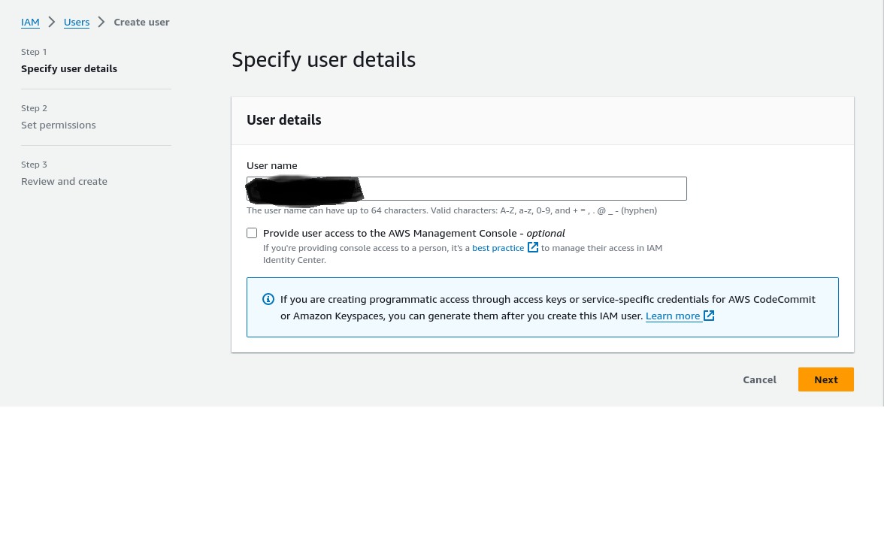
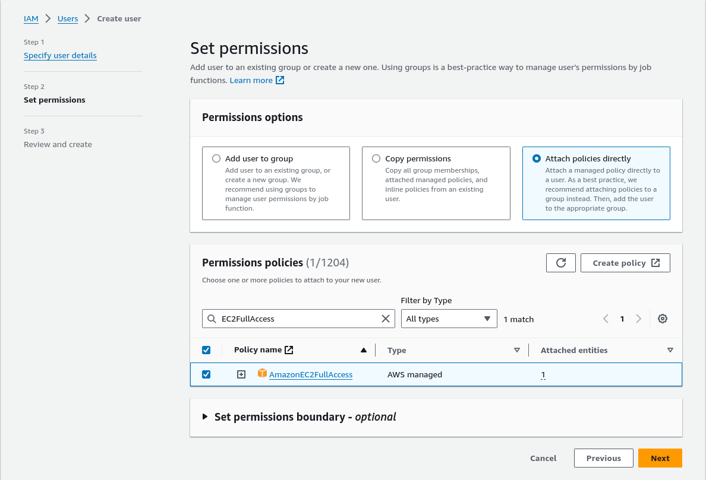
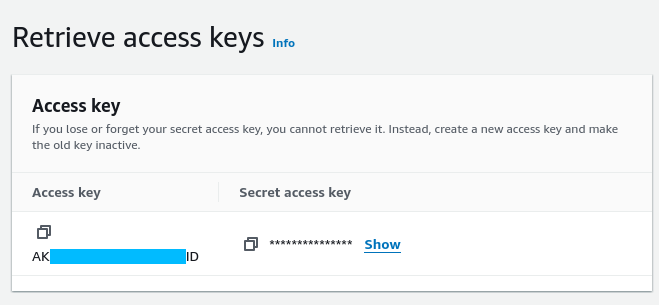

# Gestion des instances EC2 AWS avec Terraform
Ce projet contient un ensemble de configurations Terraform pour déployer une instance EC2 sur AWS.

## Contenu
- Création d'un VPC.
- Déploiement de groupes de sécurité pour permettre les connexions SSH et HTTP.
- Génération d'une clé SSH pour sécuriser l'accès aux instances.
- Configuration des réseaux (subnets) pour isoler les instances dans des sous-réseaux spécifiques.

## Prérequis
- Terraform installé sur votre machine.
- Un compte AWS et des clés d'accès configurées pour Terraform.
- ## Obtention des identifiants
Les identifiants peuvent être générés pour un utilisateur AWS dans la console IAM :
[https://us-east-1.console.aws.amazon.com/iam/home#/users](https://us-east-1.console.aws.amazon.com/iam/home#/users)

Tout d'abord, créez un utilisateur si vous n'en avez pas déjà un :

L'utilisateur doit avoir des permissions sur le service EC2 pour pouvoir créer des instances et des équilibres de charge :

> Les permissions ne doivent pas être attachées directement à un utilisateur, utilisez plutôt un groupe.

Ensuite, générez les clés d'accès pour votre utilisateur : [https://docs.aws.amazon.com/IAM/latest/UserGuide/id_credentials_access-keys.html](https://docs.aws.amazon.com/IAM/latest/UserGuide/id_credentials_access-keys.html)

Notez l' _Access Key_ et l' _Access Secret Key_ générées.

## Variables d'environnement requises

Ce projet nécessite 2 variables d'environnement pour fonctionner :

| env                   | valeur                                               |
|-----------------------|------------------------------------------------------|
| AWS_ACCESS_KEY_ID     | La clé d'accès générée à l'étape précédente         |
| AWS_SECRET_ACCESS_KEY | La clé d'accès secrète générée à l'étape précédente |

## Installation
1. Clonez ce projet.
2. Modifiez les fichiers de variables si nécessaire.
3. Exécutez les commandes Terraform suivantes : 
   - terraform init
   - terraform plan
   - terraform apply

## A propos de ce projet
Ce projet est un exemple de la gestion d'infrastructure avec Terraform pour AWS, incluant la création d'instances EC2, la gestion des réseaux, et la sécurité.
